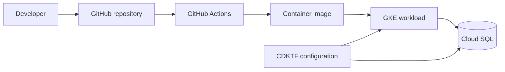

# Cloud Infrastructure Engineer Portfolio

[](https://github.com/LanxiangZhangAlex/infrastructure-engineer-technical-task/actions/workflows/ci-cd.yml)

A take-home project demonstrating how I package a TypeScript service, validate it in CI, and define a production-oriented Google Cloud deployment with Kubernetes and infrastructure as code.

> Portfolio note: this repository is a technical exercise, not a live production system. Deploying it requires your own Google Cloud project and credentials.

## What this project demonstrates

- Containerizing a TypeScript application with Docker
- Automated build and validation with GitHub Actions
- Kubernetes Deployment and Service manifests
- Google Kubernetes Engine (GKE) and Cloud SQL infrastructure with CDK for Terraform
- Infrastructure tests and a clear path from source code to deployment

## Architecture



## Repository layout

| Path | Purpose |
| --- | --- |
| `application/` | TypeScript service and Dockerfile |
| `.github/workflows/ci-cd.yml` | CI/CD workflow |
| `kubernetes/` | Kubernetes Deployment and Service |
| `my-infrastructure/` | CDKTF infrastructure definitions and tests |

## Prerequisites

- Node.js and npm
- Docker
- kubectl
- Google Cloud SDK
- Terraform and CDKTF
- A Google Cloud project with billing and the required APIs enabled

## Quick start

### Run the application locally

```bash
cd application
npm install
npm run build
npm start
```

### Build and run the container

```bash
docker build -t infrastructure-task ./application
docker run --rm -p 3000:3000 infrastructure-task
```

### Validate the infrastructure

```bash
cd my-infrastructure
npm install
npm test
npx cdktf synth
```

Review the generated Terraform plan before applying it. Cloud deployment creates billable resources.

## Design decisions

- **Managed Kubernetes:** GKE reduces control-plane operational overhead.
- **Managed database:** Cloud SQL provides backups, patching, and high-availability options.
- **Infrastructure as code:** CDKTF keeps infrastructure definitions reviewable and repeatable in TypeScript.
- **Separate Kubernetes manifests:** workload configuration remains visible and independently auditable.
- **Automated validation:** CI catches application, container, and infrastructure regressions early.

## Production hardening

Before production use, I would add workload identity, Secret Manager integration, least-privilege IAM, image vulnerability scanning, policy checks, environment-specific state, observability, autoscaling, network policies, database private connectivity, backup validation, and a documented rollback procedure.

## Skills demonstrated

Docker · Kubernetes · GCP · GKE · Cloud SQL · Terraform/CDKTF · GitHub Actions · TypeScript · CI/CD
